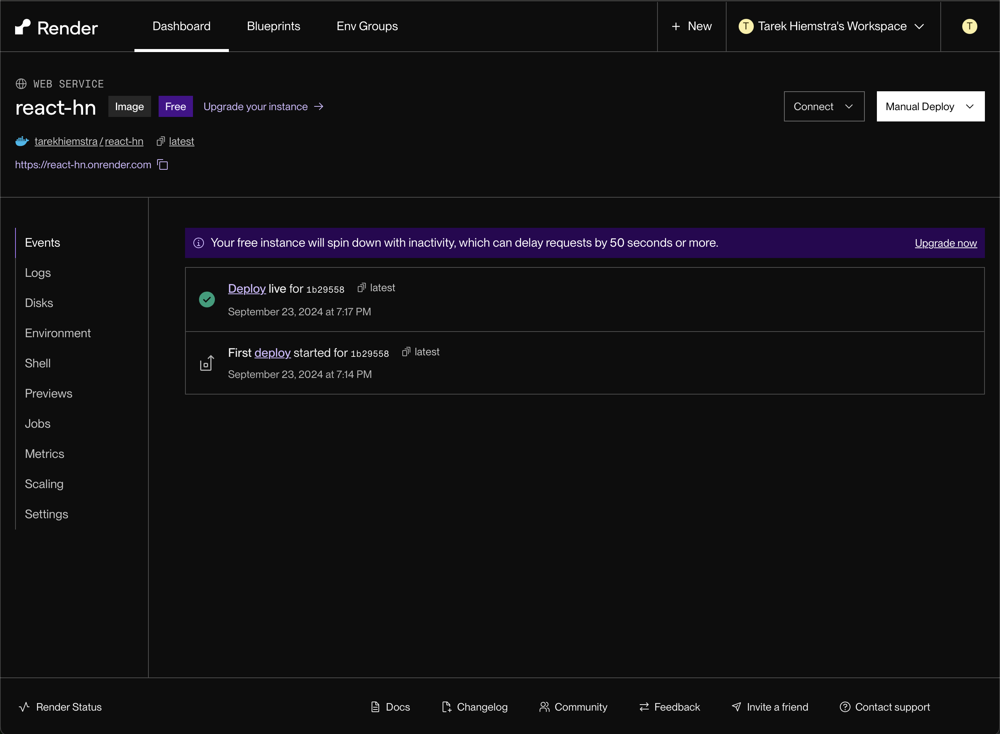

# EXERCISE 1.16 brief description and link to the running app

## Description
I used the Docker image from exercise 1.15, since I already integrated a NGINX web server into it.
For deploying in the clouse I chose render.com, because they have a free tier for hobby projects.

At Render I chose to add a new *Web Service* with my existing Docker image `tarekhiemstra/react-hn`
After that I deployed, and Render automatically detected the exposed port 80.

## Link
[http://react-hn.onrender.com/](http://react-hn.onrender.com/)

## Screenshot

