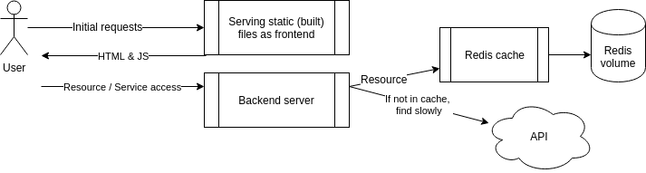

# EXERCISE 2.4

In this exercise you should expand the configuration done in [Exercise 2.3](../exercise2.3) and set up the example backend to use the key-value database [Redis](https://redis.com/).

Redis is quite often used as a [cache](https://en.wikipedia.org/wiki/Cache_(computing)) to store data so that future requests for data can be served faster.

The backend uses a slow API to fetch some information. You can test the slow API by requesting `/ping?redis=true` with curl. The frontend app has a button to test this.

So you should improve the performance of the app and configure a Redis container to cache information for the backend. The
[documentation](https://hub.docker.com/_/redis/) of the Redis image might contain some useful info.

The backend [README](https://github.com/docker-hy/material-applications/tree/main/example-backend) should have all the information that is needed for configuring the backend.

When you've correctly configured the button will turn green.

Submit the docker-compose.yml

  

The [restart: unless-stopped](https://docs.docker.com/compose/compose-file/compose-file-v3/#restart) configuration can help if the Redis takes a while to get ready.
