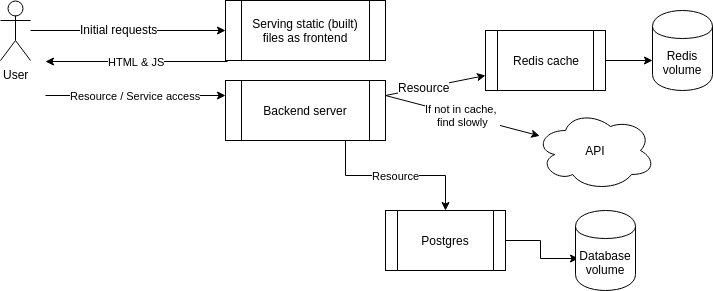

# EXERCISE 2.6

Let us continue with the example app that we worked with in [Exercise 2.4](../exercise2.4).

Now you should add a database to the example backend.

Use a Postgres database to save messages. For now, there is no need to configure a volume since the official Postgres image sets a default volume for us. Use the Postgres image documentation to your advantage when configuring: [https://hub.docker.com/\_/postgres/](https://hub.docker.com/_/postgres/). Especially part _Environment Variables_ is a valuable one.

The backend [README](https://github.com/docker-hy/material-applications/tree/main/example-backend) should have all the information needed to
connect.

There is again a button (and a form!) in the frontend that you can use to ensure your configuration is done right.

Submit the docker-compose.yml

TIPS:
* When configuring the database, you might need to destroy the automatically created volumes. Use commands `docker volume prune`, `docker volume ls` and `docker volume rm` to remove unused volumes when testing. Make sure to remove containers that depend on them beforehand.
* `restart: unless-stopped` can help if the Postgres takes a while to get ready

